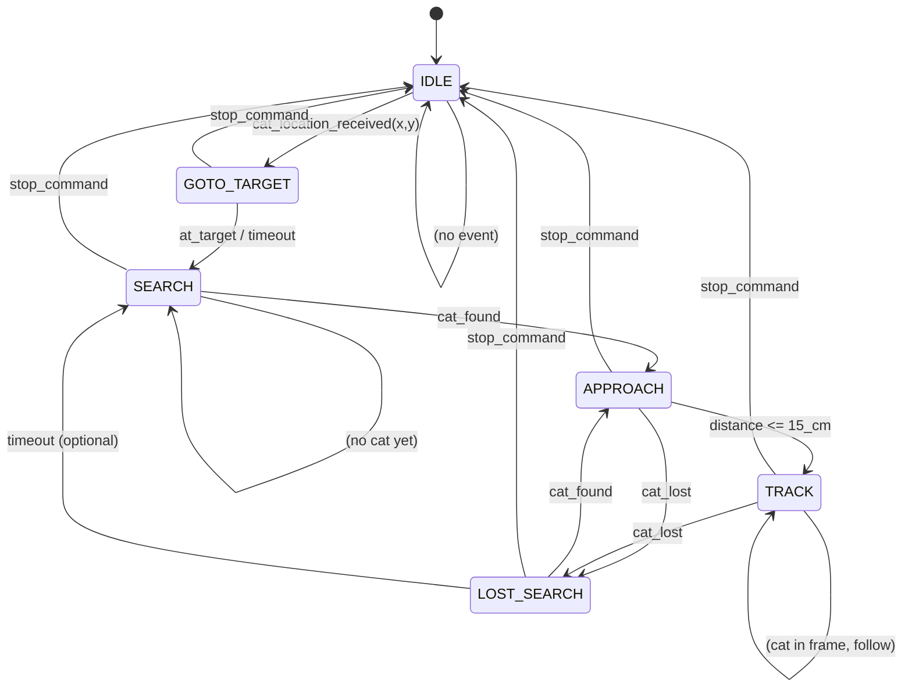

# High-Level Design: Cat-Follow Car with State Machine

This document defines the **high-level design**, **state machine**, and **baby step-by-step implementation plan** for a PiCar-X that: stays at home (0,0), receives a cat location, drives toward it, searches for the cat, approaches to 15 cm, follows the cat if it moves, re-acquires on loss, and stops only on command. **Each step is testable in isolation.**

**Clarifications (camera straight, car centers cat, calibration, modular file plan):** see **DESIGN_CAT_FOLLOW_CLARIFICATIONS_AND_FILE_PLAN.md**.

---

## 1. High-Level Design

### 1.1 Components

| Component | Role |
|-----------|------|
| **State machine** | Single source of truth for mode: IDLE → GOTO_TARGET → SEARCH → APPROACH → TRACK → LOST_SEARCH; transitions on events. |
| **Position (x, y)** | Odometry from home (0,0); time + speed + steering (or IMU later). Used for “drive toward (x,y)” and “return home” if needed. |
| **Cat target (x, y)** | Received from external (e.g. MQTT, HTTP, button). Optional: from camera when in SEARCH/TRACK. |
| **Cat detector** | TFLite/COCO or custom; class “cat”, returns bbox(es). Runs at ~5–10 FPS or every N frames. |
| **Cat tracker** | OpenCV (e.g. KCF); updated every frame from detector bbox. Target: **30 FPS** for TRACK/APPROACH. |
| **Distance to cat** | From bbox size (approximate) or ultrasonic if cat is in front; “15 cm” via calibration (bbox area or known size). |
| **Motion controller** | Translates “go to (x,y)”, “car steer+drive to center cat in frame (camera straight)”, “drive straight”, “arc search” into picar-x commands. |
| **Command interface** | “Set cat location (x,y)”, “Stop”. Optional: “Go home”, “Start”. |

### 1.2 Data Flow (Simplified)

```
[External] cat_location (x,y) ──► State machine ──► Motion: drive toward (x,y)
                                                          │
Camera (fixed) ──► Detector (cat bbox) ──► Tracker (30 FPS) ──►│──► Motion: car steer+drive to center cat, 15 cm
                                                          │
         "lost" / "found" / "at 15 cm" ──────────────────►│
         stop_command ──────────────────────────────────► State machine ──► Motion: stop
```

### 1.3 Constraints

- **Tracking stage at 30 FPS:** Camera capture + tracker.update() (+ optional detector every K frames) must run at 30 FPS; detection can be every 5–10 frames.
- **15 cm from cat:** Estimated from bbox size (calibrate: bbox area vs distance) or sensor; stop when estimated distance ≤ 15 cm.
- **Search behavior:** e.g. drive a short arc (turn in place or small circle) while running detector until “cat” found, then transition to APPROACH/TRACK.

---

## 2. State Machine

### 2.1 States

| State | Description | Motion | Exit conditions |
|-------|-------------|--------|------------------|
| **IDLE** | Car at home (0,0), not moving. | Stop. | On `cat_location_received(x,y)` → GOTO_TARGET. |
| **GOTO_TARGET** | Driving toward target (x,y). | Move toward (x,y) using odometry/heading. | On `at_target` or `timeout` → SEARCH. On `stop_command` → IDLE. |
| **SEARCH** | Looking for cat (no bbox yet). | Search pattern (e.g. arc, pan scan). | On `cat_found` (bbox) → APPROACH. On `stop_command` → IDLE. |
| **APPROACH** | Cat in frame; driving toward cat to 15 cm. | **Car** steers and drives to keep cat in **middle of frame** (camera straight); approach until distance ≤ 15 cm. | On `distance <= 15_cm` → TRACK. On `cat_lost` → LOST_SEARCH. On `stop_command` → IDLE. |
| **TRACK** | Following cat at ~15 cm. | **Car** steers and drives to keep cat in **middle of frame** and ~15 cm (camera straight). | On `cat_lost` → LOST_SEARCH. On `stop_command` → IDLE. |
| **LOST_SEARCH** | Lost cat; re-acquiring. | Search behavior (arc / pan scan). | On `cat_found` → APPROACH. On `timeout` → SEARCH (wider?) or IDLE. On `stop_command` → IDLE. |

### 2.2 Events (Inputs to State Machine)

| Event | When |
|-------|------|
| `cat_location_received(x, y)` | External: user/app sends target location. |
| `at_target` | Car position (x,y) within threshold of target. |
| `timeout` | Max time in state exceeded (e.g. goto timeout, search timeout). |
| `cat_found` | Detector/tracker reports at least one “cat” bbox. |
| `cat_lost` | No cat bbox for N consecutive frames (e.g. N=15 at 30 FPS = 0.5 s). |
| `distance <= 15_cm` | Estimated distance to cat ≤ 15 cm. |
| `stop_command` | External: user/app sends stop. |

### 2.3 State Machine Diagram (Mermaid)



### 2.4 State Machine Diagram (ASCII)

```
                    cat_location_received(x,y)
    ┌─────────┐  ───────────────────────────────►  ┌───────────────┐
    │  IDLE   │                                      │ GOTO_TARGET   │
    │ (0,0)   │  ◄───────────────────────────────   │ drive to(x,y) │
    └────┬────┘            stop_command              └───────┬───────┘
         │                                                   │
         │                                                   │ at_target / timeout
         │ stop_command                                      ▼
         │              ┌─────────────────────────────────────────┐
         │              │              SEARCH                      │
         │              │  (arc / pan; run detector until cat)      │
         │              └─────────────────────┬───────────────────┘
         │                                    │ cat_found
         │                                    ▼
         │              ┌─────────────────────────────────────────┐
         │              │            APPROACH                      │
         │              │  car steer+drive, cat in center; ≤15cm  │
         │              └──────┬──────────────────────┬─────────────┘
         │                     │ distance≤15cm       │ cat_lost
         │                     ▼                     ▼
         │              ┌─────────────┐      ┌───────────────┐
         │              │   TRACK      │      │ LOST_SEARCH   │
         │              │ follow @15cm │◄─────│ arc, re-find   │
         │              └──────┬──────┘      └───────┬───────┘
         │                     │ cat_lost            │ cat_found
         │                     └───────────────────┘
         │
         └────────────────── stop_command from any state ──► IDLE
```

---

## 3. Baby Step-by-Step Implementation (Each Step Testable)

Each step is a **small deliverable** you can run and verify before moving on.

---

### Phase 0: Setup and Stubs

| Step | What to do | How to test |
|------|------------|-------------|
| **0.1** | New project folder/module (e.g. `cat_follow/`) with `state_machine.py` defining states (enum) and events (names only). No transitions yet. | Import; print current state. |
| **0.2** | State machine: implement transition table (dict or if/elif) for all transitions in §2. Single function `dispatch(event, payload)` that updates internal state and returns new state. | Unit test: send events in sequence, assert state changes (e.g. IDLE → GOTO_TARGET → SEARCH → APPROACH → TRACK → IDLE on stop). |
| **0.3** | Stub “motion” module: functions `stop()`, `go_to_xy(x,y)`, `search_arc()`, `approach_bbox(bbox)`, `track_bbox(bbox)`. Each only prints and/or sets a “last command” variable. | Call each from a script; assert “last command” or log. |
| **0.4** | Stub “sensors”: `get_cat_location_from_external()` (returns None or (x,y)); `get_stop_command()` (returns bool). Read from file or keyboard for tests. | Script: set (x,y) in file, run loop; assert state machine receives event. |

---

### Phase 1: Idle at Home (0,0)

| Step | What to do | How to test |
|------|------------|-------------|
| **1.1** | Odometry module: init (0,0), heading 0; update from picar-x `forward/backward` duration and `dir_current_angle` (time-based dead reckoning). Expose `get_position()`, `get_heading()`, `set_origin_here()`. | Run car forward 1 s at known speed; check (x,y) change; no car needed if you mock motor calls. |
| **1.2** | “Home” = (0,0). On start, set odometry origin to (0,0). Motion stub: in IDLE, call `stop()` and do not call any drive. | Start state machine in IDLE; call `tick()`; assert motion is “stop” only. |
| **1.3** | Integrate real picar-x: in motion stub replace `stop()` with `px.stop()`. Run on Pi. | Run program; car must not move; state remains IDLE. |

---

### Phase 2: Receive Cat Location and Drive Toward It

| Step | What to do | How to test |
|------|------------|-------------|
| **2.1** | Command interface: function or thread that reads “cat location” (e.g. from file, socket, or MQTT). When (x,y) received, push event `cat_location_received(x,y)` into state machine. | Simulate (x,y); assert state goes to GOTO_TARGET. |
| **2.2** | Motion: implement `go_to_xy(x, y)` using odometry. Compute bearing to (x,y); set steering; drive forward until `distance_to_target <= threshold`; then stop. Use only odometry (no obstacle avoidance yet). | Unit test with mocked odometry. On Pi: give (50,0); car should drive forward and stop near (50,0). |
| **2.3** | State machine: in GOTO_TARGET, call `go_to_xy(target_x, target_y)` each tick. When odometry says “at target”, emit `at_target` and transition to SEARCH. | Run on Pi; send (x,y); car drives toward it; state switches to SEARCH when close. |

---

### Phase 3: Search for Cat

| Step | What to do | How to test |
|------|------------|-------------|
| **3.1** | Camera + detector: run vilib (or Picamera2) at 640×480; every 5th frame run COCO detector; filter class “cat”. Expose `get_cat_bbox()` → None or (x, y, w, h). | Run on Pi; point at cat; assert bbox when cat visible; None when not. |
| **3.2** | Motion: implement `search_arc()` — e.g. turn in place (set steering, low forward speed) for 2–3 s then stop; or drive a small curve. | Run on Pi; car performs arc; no cat needed. |
| **3.3** | State machine: in SEARCH, call `search_arc()` in a loop and `get_cat_bbox()` each frame. On first non-None bbox, emit `cat_found`, pass bbox, transition to APPROACH. | Run on Pi; no cat → car arcs; when cat appears in view, state goes to APPROACH. |

---

### Phase 4: Approach to 15 cm

| Step | What to do | How to test |
|------|------------|-------------|
| **4.1** | Distance calibration: record bbox area (or width) vs real distance (e.g. 20, 30, 50 cm); fit simple curve. Function `estimate_distance_cm(bbox)` → cm. | Offline: use saved images with known distance; assert estimate is plausible. |
| **4.2** | Motion: `approach_bbox(bbox)` — car steers and drives to center bbox in frame; if distance > 15 cm drive forward; else stop. Use 30 FPS loop: tracker.update() every frame; detector every 5–10 frames to re-init tracker. | Run on Pi; cat in frame; car approaches and stops when estimated distance ≤ 15 cm. |
| **4.3** | State machine: in APPROACH, each tick get bbox (from tracker + detector); call `approach_bbox(bbox)`; if `estimate_distance_cm(bbox) <= 15` emit `distance <= 15_cm` → TRACK; if bbox None for N frames emit `cat_lost` → LOST_SEARCH. | Run on Pi; approach then transition to TRACK at 15 cm; or lose cat and go to LOST_SEARCH. |

---

### Phase 5: Track at 30 FPS and Follow If Cat Moves

| Step | What to do | How to test |
|------|------------|-------------|
| **5.1** | 30 FPS loop: one thread or loop that (a) grabs frame, (b) runs tracker.update(), (c) every K frames runs detector and re-inits tracker if cat bbox, (d) returns current bbox. Measure FPS; tune resolution/detector frequency to hold ~30 FPS. | Run; print FPS; assert ~30. |
| **5.2** | Motion: `track_bbox(bbox)` — same as approach: car steers/drives to center; maintain distance ~15 cm (small forward/back if needed). | Run with moving cat; car follows. |
| **5.3** | State machine: in TRACK, use 30 FPS bbox; call `track_bbox(bbox)`; if bbox None for N frames → `cat_lost` → LOST_SEARCH. | Run; move cat; car follows; when cat leaves frame, state goes to LOST_SEARCH. |

---

### Phase 6: Lost → Search (Re-acquire)

| Step | What to do | How to test |
|------|------------|-------------|
| **6.1** | Same search behavior as SEARCH: `search_arc()` (or drive short arc) while running detector. On `cat_found` → APPROACH. Optional: timeout → SEARCH (wider) or IDLE. | Run; hide cat then show again; car does arc and re-acquires. |
| **6.2** | State machine: LOST_SEARCH already defined; wire motion and `cat_found` / `timeout` / `stop_command`. | Full test: TRACK → lose cat → LOST_SEARCH → find cat → APPROACH. |

---

### Phase 7: Stop Command Only Stops Movement

| Step | What to do | How to test |
|------|------------|-------------|
| **7.1** | Command interface: “stop” (button, file, MQTT, HTTP). Push `stop_command` into state machine from any state. | From each state, send stop; assert state becomes IDLE and motion is stop. |
| **7.2** | State machine: every state has transition to IDLE on `stop_command`; in IDLE only `stop()` is called. | Run full scenario; only stop command stops the car. |

---

### Phase 8: Integration and Tuning

| Step | What to do | How to test |
|------|------------|-------------|
| **8.1** | End-to-end: IDLE → send (x,y) → GOTO_TARGET → at target → SEARCH → cat found → APPROACH → 15 cm → TRACK → (optional) lose → LOST_SEARCH → find → APPROACH; stop only on command. | Full run on Pi with cat. |
| **8.2** | Tune: 30 FPS (resolution, detector interval), 15 cm calibration, “cat_lost” N frames, search arc duration. | Repeat 8.1 and adjust. |

---

## 4. File Plan (Modular)

See **DESIGN_CAT_FOLLOW_CLARIFICATIONS_AND_FILE_PLAN.md** for the full modular layout, calibration (speed–time–distance, max U-turn), and per-module responsibilities. Short version:

```
cat_follow/
  state_machine.py      # States, events, dispatch() only
  commands.py          # cat_location (x,y), stop_command
  motion/
    driver.py          # stop(), forward(), set_steer() – uses calibration limits
    goto_xy.py         # go to (x,y) using odometry + calibration
    center_cat.py     # steer + drive to keep bbox center = image center (camera straight)
    search.py          # arc search – uses steering limits
    limits.py          # clamp steer, speed from calibration
  vision/
    detector.py        # get_cat_bbox() vilib/TFLite COCO
    tracker.py         # 30 FPS tracker + detector every K frames
    distance.py        # estimate_distance_cm(bbox) from calibration
  odometry.py          # (x,y), heading
  calibration/
    loader.py          # load speed–time–distance, steering_limits, bbox_distance
    *.json             # speed_time_distance, steering_limits, bbox_distance
  main_loop.py         # tick: commands → state_machine → motion
  tests/               # per-module tests
```

---

## 5. Summary

- **High-level design:** State machine + odometry + cat (x,y) input + detector + tracker (30 FPS) + motion (goto, search, approach, track) + stop command.
- **State machine:** IDLE ↔ GOTO_TARGET → SEARCH → APPROACH ↔ TRACK ↔ LOST_SEARCH; `stop_command` → IDLE from any state.
- **Baby steps:** Phase 0 (stubs + state machine), 1 (idle at 0,0), 2 (receive (x,y), drive to target), 3 (search), 4 (approach to 15 cm), 5 (track at 30 FPS), 6 (lost search), 7 (stop command), 8 (integration). Each step has a concrete test.
- **Tracking at 30 FPS:** Dedicated loop with tracker.update() every frame and detector every K frames; tune resolution and K to hold 30 FPS on Pi 4.

You can implement and test phase by phase; the state machine diagram and transitions in §2 are the single reference for behavior.
