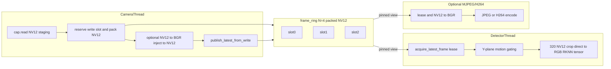

# Frame Ring Ownership Audit

**Status:** Ring leases, native RKISP NV12 ring, and direct NV12→RGB RKNN input implemented and board-tested
**Date:** 2026-07-24
**Scope:** Production perception frame sharing in `cat_follow` vs `picarx_cat tracker` (Cat Dome)

This document consolidates three architecture audits:

- [Audit car-x frame sharing](e0561200-1f12-4d4a-a035-6a06e9a615ab) — current car-x ring, copy costs, race analysis
- [Compare zero-copy designs](5693520a-e3f1-46f0-8c5f-1989d651ff72) — design options for multi-reader car-x
- [Audit Cat Dome zero-copy](25fbca8b-fd35-4cd5-b8f3-a961e8d53927) — picarx reference implementation

Detection and tracking **must remain independent of the web UI** (see workspace architecture rules). Streaming copies are optional; the camera → detector path is not.

---

## Executive summary

| Aspect | car-x today | picarx_cat tracker (Cat Dome) |
|--------|-------------|-------------------------------|
| Ring size | 4 slots, 640×480 NV12 (~450 KiB/slot) | 3 slots, 4K NV12 (~12 MB/slot) |
| Handoff | **Refcounted leases** + per-slot generation | **Zero-copy views** + generation guards |
| Readers | Detector, MJPEG, H264 (multi-thread) | Single Proc consumer on ring |
| Tear safety | Refcount pins + per-slot odd/even generation | Per-slot `_ring_gen` odd/even + `_ring_slot_changed` |
| Detector path | Lease → packed 320×320 NV12 crop → RGB tensor → RKNN | Proc holds ring view; AI uses separate crop pool |
| Recommended target | **Refcounted ring leases + per-slot generation** | Adapt picarx gen/tear + explicit multi-reader safety |

car-x now pins ring slots across detector and stream reads. The camera never
reuses the latest or a pinned slot and drops capture frames when all slots are
busy. The detector's former ~921 KB `snapshot_detector_frame` copy and legacy
`frame_for_detector` allocation are removed.

The OpenCV V4L2 backend now requests unconverted bytes and packs the validated
`/dev/video11` 640×480 NV12 source directly into the ring. Motion uses the
zero-copy Y-plane view; RKNN converts only a packed 320×320 crop. MJPEG
converts at its optional viewer boundary; H.264 feeds leased NV12 directly to
MPP and copies only when wrapping the synchronous GStreamer input buffer. An
`mppjpegdec` stage is not applicable to this raw RKISP source.

---

## 1. car-x current architecture

### 1.1 Memory pool

[`cat_follow/memory/pool.py`](../memory/pool.py):

- `FRAME_RING_N = 4`, shape `(4, 720, 640)` uint8 packed NV12
- `frame_for_detector` has been removed
- Static frame RAM: ~1.8 MiB (4 ring slots)

### 1.2 Synchronization

[`cat_follow/memory/shared_state.py`](../memory/shared_state.py):

| API | Behavior |
|-----|----------|
| `try_get_write_buffer()` | Under lock, reserves a non-latest slot with `refcount == 0`; returns `None` if full |
| `publish_latest_from_write()` | Marks generation stable, advances capture sequence and latest index |
| `acquire_latest_frame()` | Increments slot refcount and returns `FrameLease(view, frame_seq, generation)` |
| `get_frame_latest(dst)` | Lock → `np.copyto(dst, ring[latest_idx])` |

### 1.3 Data flow



**Tracker** ([`cat_follow/threads/tracker.py`](../threads/tracker.py)) does not read frames — only detector outputs matched by `_detector_frame_gen`.

**Live injection** ([`cat_follow/perception/live_cat_injector.py`](../perception/live_cat_injector.py)) converts and mutates the writer-owned reserved slot before publish; leased slots are never changed.

### 1.4 Copy-cost inventory (640×480 NV12 = 450 KiB)

| Stage | When | Full-frame copies | Notes |
|-------|------|-------------------|-------|
| Camera → ring | ~30 FPS | 1× 450 KiB `copyto` | `cap.read()` owns its buffer; no full-frame color conversion at 640×480 |
| Detector | `DETECT_FPS` (default 5) | 0× full-frame | Copies packed 320×320 Y+UV crop; no intermediate BGR image |
| RKNN preprocess | On detect ticks | 0× full 640×480 | NV12→RGB directly into 320×320 `_input_buf`; no letterbox |
| MJPEG client | ~10 FPS | 1× NV12→BGR display | Required only while a viewer requests overlays/JPEG |
| H264 client | ~15 FPS | 1× packed NV12 `tobytes` | Direct `format=NV12` appsrc; no color conversion |

**Headless production (no stream):** one 450 KiB OpenCV staging → ring copy per
camera frame; no full-frame BGR conversion and no detector full-frame copy.

### 1.5 Why direct ring views are unsafe today

If the detector did:

```python
with lock:
    idx = self._latest_idx
view = pool.frame_ring[idx]  # release lock
backend.infer_all(view, ...)  # slow, lock-free
```

After **3** camera publishes, `write_idx` wraps to `idx` and the camera `copyto`s into that slot while NPU still reads it → **torn/corrupt frame**. At 30 FPS the window is ~100 ms; RKNN + postprocess can exceed that.

Copy-out readers avoid this because each consumer owns its `dst` after the locked copy.

### 1.6 Latent issues (lower severity)

| Risk | Location | Notes |
|------|----------|-------|
| Unlocked `get_write_buffer()` | `shared_state.py` | OK with single camera writer; breaks if second writer added |
| OpenCV `cap.read()` + resize alloc | `threads/camera.py` | Per-frame alloc outside pool discipline |
| OpenCV capture staging | `threads/camera.py` | `cap.read()` still owns one raw NV12 buffer before the ring pack |

---

## 2. picarx_cat tracker reference (Cat Dome)

Primary source: `picarx_cat tracker/web/app.py` (`VideoProcessor`). Audited in [Audit Cat Dome zero-copy](25fbca8b-fd35-4cd5-b8f3-a961e8d53927).

### 2.1 Thread model

| Thread | Role |
|--------|------|
| `CatDome-Cap` | VPU decode, RGA lores, ring pack, H264 submit |
| `CatDome-Proc` | Motion, phases, AI crop submit, tracker — **sole ring consumer** |
| `CatDome-AI` / `CatDome-Post` | RKNN invoke + CPU postprocess on **owned crop buffers**, not ring |
| `CatDome-H264` | Encode from **owned-buffer pool** (copy out of ring) |

### 2.2 Ring slot lifecycle

1. Cap picks write slot `wi`; **skips** if `wi == _ring_last_read` (Proc still holding that slot)
2. `_ring_gen[wi] += 1` → **odd** (write in progress)
3. Decode/RGA/pack into slot
4. On success: `_ring_gen[wi] += 1` → **even** (stable); `_ring_last_written = wi`
5. `_frame_seq += 1` + `Condition.notify()` — Proc never misses a publish

Proc reads `_ring_last_written`, snapshots `_gen_before` (must be even), holds **view** into `_ring_main[ri]`. Before pixel publish or AI submit: `_ring_slot_changed(ri, _gen_before)` → skip if Cap overwrote slot.

**Inject:** copies ring view before paste (`frame.copy()`) — never mutates shared ring slot while readers exist.

### 2.3 Zero-copy terminology (picarx)

| Category | Meaning | Example |
|----------|---------|---------|
| True HW zero-copy | CPU never maps 4K for motion; RGA reads decoder dmabuf fd | fd RGA lores path |
| Copy avoidance | Preallocated `dst=`; one pack into ring; no per-frame alloc | `read_main(dst=_ring_main[wi])` |
| Unavoidable copy | Isolation, format change, async consumer | AI crop pool, H264 `np.copyto`, RKNN output pool |

### 2.4 Async consumer pattern

H264, recording, and AI **do not** hold ring pointers across slow work:

- **AI crop pool:** `AI_QUEUE_DEPTH + 2` owned buffers; Proc extracts crop + `cvtColor` into pool
- **H264 pool:** `H264_BUFFER_POOL_SIZE = 2`; `np.copyto` into free buf → worker encodes → return buf; queue full → latest-wins drop
- **RKNN output pool:** copies NPU tensors before Post reads them

### 2.5 picarx patterns worth porting to car-x (priority)

1. **3-slot ring + per-slot generation + reader-skip + torn-read gates** — car-x has ring indices but lacks gen counters and reader-skip
2. **Condition + monotonic `_frame_seq`** — avoids binary-Event coalesce races (less critical for car-x's polling detector, still useful)
3. **Owned-buffer pools for async encoders** — any H264/recording worker must copy out of ring (picarx `MppH264Service` pattern)
4. **Separate validity flags** — e.g. `_ring_full_frame_valid` for IDLE 4K-skip (adapt as motion-only lores gating on 1 GB boards)
5. **NV12 + fd RGA capture** — future MPP path on RK3576; not required for current OpenCV BGR pipeline

**Do not port blindly:** picarx assumes **one ring consumer** (Proc). car-x has **multiple independent reader threads** (detector + MJPEG + H264).

---

## 3. Design comparison for car-x multi-reader layout

Evaluated in [Compare zero-copy designs](5693520a-e3f1-46f0-8c5f-1989d651ff72).

### 3.1 Option A — Refcounted ring leases (recommended)

Each slot: `{generation, refcount}`. Camera publishes into a write slot; readers `acquire` → `FrameLease(view, gen)` → `release`. Camera reuses slot only when `refcount == 0`.

| Path | Behavior |
|------|----------|
| camera → detector | Hold lease through RKNN infer; **zero full-frame copy** |
| camera → MJPEG/H264 | Non-blocking `try_acquire_latest()`; skip tick if busy (latest-wins) |
| inject | Mutate camera staging only; never inject into slot with `refcount > 0` |
| lag | Camera drops frames when all slots leased; readers never see torn data |

**Pros:** Safest multi-reader model; combines picarx tear semantics with explicit pinning.
**Cons:** RAII discipline in Python; likely need `FRAME_RING_N = 4–5` for detector + dual streams.

### 3.2 Option B — Reader index acknowledgements

Per-consumer read cursor; writer skips slot if any consumer has not acked.

**Pros:** Simple for 2-thread systems; picarx proves single `_ring_last_read`.
**Cons:** Awkward with 3+ readers at different rates; still needs gen counter for zero-copy views.

### 3.3 Option C — Latest-slot copy-out (historical car-x baseline)

Readers always `copyto` under lock.

**Pros:** Simplest correct design; no lease bugs.
**Cons:** Highest bandwidth; detector copies every tick regardless of motion gate.

### 3.4 Verdict

**Refcounted leases + per-slot generation** is implemented for detector,
MJPEG, and H.264. `get_frame_latest(dst)` remains as a compatibility copy-out
escape hatch.

---

## 4. Copies: what stays vs what goes under the target design

### 4.1 Target design decisions (2026-07-23)

These constraints revise the earlier “unavoidable” list:

| Decision | Implication |
|----------|-------------|
| Capture = OpenCV V4L2 raw NV12 into ring slot | Keeps one `cap.read()` staging buffer and one packed ring write; optional GStreamer mmap CPU pack remains fallback |
| Camera locked at **640×480** | **No capture resize** — perception frame size equals camera size |
| Native **NV12** ring (picarx-style) | Motion stays on Y; AI converts its crop directly to RGB; BGR remains only at inject/MJPEG boundaries |
| Detector input = **center-bottom 320×320 crop** from 640×480 | **No letterbox/resize** — same rule as picarx `AI_CROP_SIZE == RKNN_INPUT_SIZE` |
| Overlays = client Canvas + JSON (picarx-style) | No server-side pixel burn-in on ring for live UI |
| Inject = copy-before-paste / writer-owned only | Never mutate a leased ring slot |

### 4.2 Still required (even in picarx)

| Copy / convert | How picarx handles it | Notes for car-x |
|----------------|----------------------|-----------------|
| OpenCV capture → ring NV12 pack | `cap.read()` + `np.copyto(..., ring_slot)` | Implemented baseline; optional GStreamer mmap CPU pack (`io-mode=2`) is fallback only. |
| NV12 crop → RGB (AI path) | `extract_nv12_crop` + `COLOR_YUV2RGB_NV12` | Writes directly into preallocated RKNN `_input_buf`; no intermediate BGR allocation |
| `rknn.inference(inputs=[buf])` | Prealloc `_input_buf`; **output** pool only | Input still CPU NumPy → NPU map; not solved as dmabuf zero-copy |
| H.264 boundary | Direct NV12 `Gst.Buffer.new_wrapped(tobytes())` | Implemented; synchronous bytes ownership permits lease release after submit |
| Inject | `frame.copy()` / NV12→BGR then paste; lores ROI paste into scratch | Writer-owned / Proc-owned copies only |
| Snapshot JPEG | `.copy()` + NV12→BGR + encode | Off hot path |

### 4.3 Eliminated under car-x target (vs today’s OpenCV BGR path)

| Former “unavoidable” | Why it goes away |
|----------------------|------------------|
| Capture resize 640×480 | Camera is already 640×480 |
| Full-frame letterbox to 320×320 | Center-bottom crop, scale=1.0 |
| Full-frame NV12→BGR every frame | Keep NV12 on ring; convert the AI crop directly to RGB and use BGR only for inject/MJPEG/snapshot |
| MJPEG overlay scratch mutating detector input | Prefer H.264 + client overlay JSON (picarx); if MJPEG kept, draw on private buf |
| Detector `snapshot_detector_frame` full copy | Ring lease / crop extract instead |
| Software full-frame lores when RGA fd available | Hardware lores Y-plane view (picarx) |

### 4.4 Lores / inject minimize options

1. **Preferred:** RGA dmabuf-fd downscale into lores NV12 slot; motion uses Y-plane **view** (no extra gray alloc).
2. **Inject:** do not re-downscale full frame — `copyto` lores scratch + **ROI-only** sprite paste (picarx `paste_on_lores`).
3. **While inject active:** force pack of main only if AI/inject needs pixels; otherwise keep lores path for motion.
4. **Optional:** run capture already at lores size for motion-only modes (picarx `CAT_DOME_LORES_DECODE`).
5. **Avoid:** software `cv2.resize` full BGR→gray every frame when hardware lores is healthy.

Zero-copy means **eliminating redundant full-frame copies and allocs**, not zero CPU touches everywhere.

---

## 5. Deferred migration sequence

Incremental phases and current status:

| Phase | Scope | Key files | Outcome |
|-------|-------|-----------|---------|
| **0 — Instrument** | Counters only | `shared_state.py`, metrics | Pending board metrics |
| **1 — Gen counter** | Per-slot odd/even generation | `shared_state.py` | **Implemented** |
| **2 — Refcount wired** | Camera skips pinned/latest slots | `pool.py`, `shared_state.py` | **Implemented** |
| **3 — Detector lease** | Lease through RKNN; center-bottom 320×320 crop | `threads/detector.py` | **Implemented** |
| **4 — Stream leases** | MJPEG/H264 leases | `routes_streaming.py`, `routes_h264.py` | **Implemented** |
| **5 — Native RKISP NV12** | Raw `/dev/video11` NV12 → NV12 ring | camera/pool/detector/stream | **Implemented and board smoke-tested** |
| **6 — Lores gen coupling** | Pair lores gen with main gen; ROI inject patch | shared state/inject | Pending |
| **7 — Retire legacy** | Remove `frame_for_detector`, stale APIs | pool/tests | **Implemented** |

### Thread contracts (implemented)

- **Camera:** `try_get_write_buffer()` → staging/inject → `publish_latest_from_write()`; drop when full
- **Detector:** one `acquire_latest_frame()` per tick when needed; hold through motion fallback + RKNN + publish; `release()` in `finally`
- **MJPEG/H264:** `acquire_latest_frame()` per encode tick; skip when `None`
- **Tracker:** unchanged — reacts to `_detector_detections_gen` changes only

### 5.1 Native NV12 roadmap ([Assess MPP NV12 port](688ed57d-eb40-4d5f-b804-65b14d8c2aa3))

**Do not use picarx `mppjpegdec` for car-x.** RKISP `/dev/video11` already delivers raw 640×480 NV12; picarx MPP decode targets USB MJPEG 4K.

| Patch | Scope | Notes |
|-------|-------|-------|
| **3 — NV12 ring + crop-at-detect** | NV12 pool `(4,720,640)`; stop full-frame BGR convert; 320×320 crop → RGB tensor → RKNN | **Implemented and validated** with production venv OpenCV |
| **4 — GStreamer capture fallback** | Optional `v4l2src io-mode=2` (mmap CPU pack); feature flag `CAT_FOLLOW_CAMERA_CAPTURE_BACKEND=gst_nv12` | Implemented; canonical 460,800-byte sample validated via `extract_dup`. `io-mode=4` (fd-only dmabuf export) is rejected for CPU ring packing because Python map/VideoInfo crashed the allocator on this board. |
| **5 — HW lores / NV12 H.264** | Direct NV12 MPP input implemented; RKISP lores self-path (`/dev/video12`) remains | `mpph264enc` is absent on the board; encoder remains optional. Prefer lores device over RGA at 640×480. |

**Model:** same `.rknn`; change preprocess/postprocess offsets (crop origin, not letterbox).

### 5.2 ROCK 4D validation (2026-07-23)

- Production venv OpenCV captured `/dev/video11` as contiguous raw NV12:
  shape `(1, 460800)`, reshaped ring slot `(720,640)`, stride 640.
- Full-frame conversion and center-bottom crop conversion matched exactly
  (`max_bgr_delta=0`) for region `(160,160,320,320)`.
- Headless camera + real RKNN detector ran without Flask/streams/motors:
  camera generation 28, detector generation 27, NPU invoke about 21–22 ms.
- Direct NV12→RGB RKNN input was validated at 30 FPS over 354 inferences:
  color conversion p50 2.08 ms (from 3.63 ms for NV12→BGR→RGB),
  detector processing p50 16.75 ms (from 18.34 ms), p95 19.57 ms, and
  zero 33.3 ms detector-processing deadline misses.
- GStreamer `v4l2src io-mode=2` (mmap CPU pack) is an optional fallback for
  system OpenCV builds that cannot open this multiplanar node. Reserve
  `io-mode=4` for a future fd-only hardware path (RGA/MPP), not ring packing.
  Production remains on verified `CAT_FOLLOW_CAMERA_CAPTURE_BACKEND=opencv`.

### Relationship to 30 FPS soak

The direct color path removes the intermediate BGR allocation and saves about
1.6 ms at p50, but does **not** remove the NPU invoke (~13–16 ms on A53). The
M4f **DETECT_FPS=30 + ROS2 soak** remains a separate validation item
([Software_Integration](Software_Integration_Autonomous_Yard_Navigator_Cat_Tracker.md) M4f).

---

## 6. Tests

| Test | File | Status |
|------|------|--------|
| Slot pinned until release | `tests/test_shared_state.py::test_frame_lease_pins_slot_until_release` | Implemented |
| Drop write when all slots leased | `tests/test_shared_state.py::test_frame_ring_drops_write_when_all_slots_are_pinned` | Implemented |
| Slow reader no tear | `tests/test_shared_state.py::test_slow_frame_reader_never_observes_torn_pixels` | Implemented |
| Center-bottom Y/UV crop mapping | `tests/test_detector_thread.py::test_center_bottom_model_crop_copies_matching_y_and_uv_planes` | Implemented |
| Detector bbox remap + crop shape | `tests/test_detector_thread.py::test_detector_preserves_primary_confidence` | Implemented |
| Ring publish + lease | `tests/test_camera_ring.py` | Implemented |
| NV12 geometry, planes, crop, conversion | `tests/test_nv12_utils.py` | Implemented |
| Center-bottom crop BGR golden equivalence | `tests/test_nv12_utils.py::test_center_bottom_crop_bgr_matches_full_frame_slice` | Implemented |
| Direct NV12→RGB equivalence/reuse | `tests/test_nv12_utils.py::test_nv12_to_rgb_matches_bgr_channel_swap_and_reuses_destination` | Implemented |
| Chroma alignment regression on odd crops | `tests/test_nv12_utils.py::test_align_nv12_crop_required_before_odd_region_extract` | Implemented |

**Still useful later:** concurrent detector + stream lease stress under board load and real `/dev/video11` color/chroma validation.

---

## 7. Code review checklist (C2)

When reviewing frame-ring changes, apply [`Code_Review_Plan.md`](Code_Review_Plan.md) C2 against this document:

- Verify single-writer on ring pixels; readers use lease or copy-out
- Do not hold `_lock_frame` across RKNN, encode, or network I/O
- Bump generation on publish; check `stale` before downstream pixel use
- Async encoders must use owned pools (picarx H264 pattern), not ring pointers
- Detection must work headless without web streams

---

## 8. References

| Resource | Path |
|----------|------|
| car-x pool | [`cat_follow/memory/pool.py`](../memory/pool.py) |
| car-x shared state | [`cat_follow/memory/shared_state.py`](../memory/shared_state.py) |
| car-x camera | [`cat_follow/threads/camera.py`](../threads/camera.py) |
| car-x detector | [`cat_follow/threads/detector.py`](../threads/detector.py) |
| picarx orchestration | `picarx_cat tracker/web/app.py` |
| picarx MPP capture | `picarx_cat tracker/camera/gst_mpp_capture.py` |
| picarx H264 pool | `picarx_cat tracker/camera/h264_mpp.py` |
